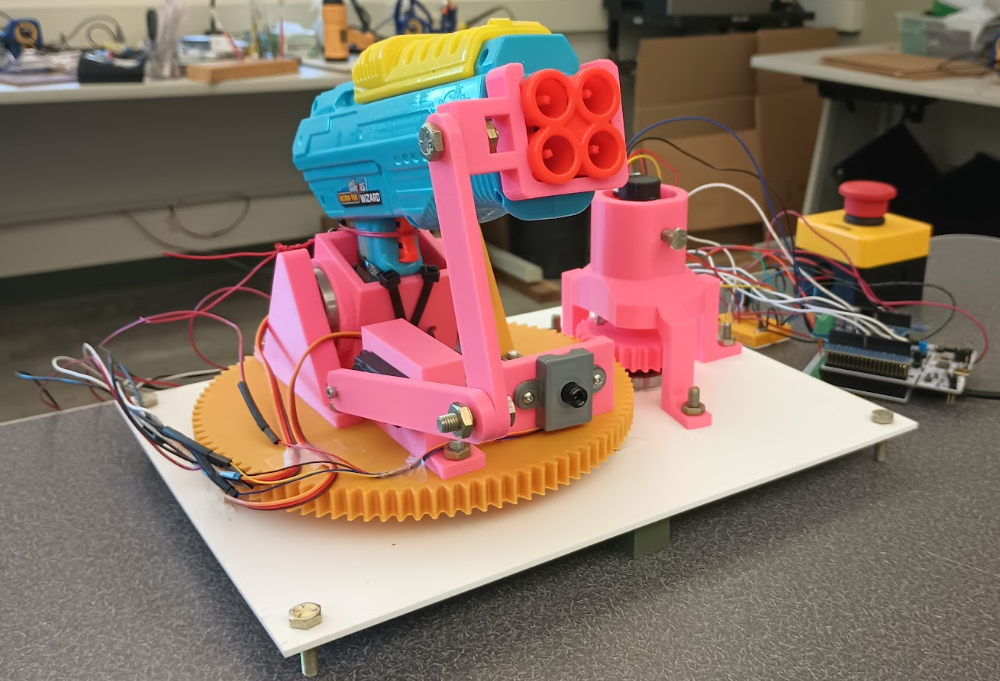

<h1>ME 405 Term Project</h1>
<h3>Scott Frizzell & Jacques Lacroix</h3>

This thermal tracking, automated NERF™ turret was designed for the Department of Foamland Security. Its primary purpose is to engage in autonomous defense.

The turret's design revolves around a pump-action NERF™ gun mounted to a 2-axis mount, allowing it to shoot in nearly any direction. The mechanism uses a brushed DC motor to control the panning motion of the gun, while a servo controls the tilting motion of the gun. A servo is used to actuate the trigger mechanism, and a thermal camera is used for tracking.

The turret uses a gear train to reduce the motor speed and increase torque to allow the gun to swivel smoothly. Multiple tooth ratios were considered, such as 120/30, but we choose a 96/30 tooth ratio because of manufacturing constraints. 

The device is powered by a 12V bench power supply. In our testing, the microcontroller was also be plugged into a computer. However it could be modified to take an input voltage from the bench power supply and run completely autonomously.

To power the DC motor, it was connected directly to the 12V supply. The servos only needed 5V, however, they drew too much current to simply connect them to the 5V output of the microcontroller. Instead, they were connect to the output of a 5V voltage regulator. The thermal camera was simply connected to the 3.3V output pin of the microcontroller, was it did not draw excess current.

The device is programmed using a cooperative, priority-based multitasking system, split into 5 tasks:
<ol>
    <li>Controls the panning motion of the turret.</li>
    <li>Controls the activation of the turret.</li>
    <li>Controls the tilting motion of the turret.</li>
    <li>Controls the targeting of the turret.</li>
    <li>Controls the actuation of the trigger.</li>
</ol>
Further information of the tasks and dependencies can be found here: https://jacqueslacroix.github.io/ME405-TermProject

Our primary takeaways from this design process were as follows:
<ul>
    <li>Tuning the camera parameters to accurately track targets would require additional work</li>
    <li>Tuning DC motor gains (KP, KI, KD) is a challenge, especially due to needing small changes in angle when tracking</li>
    <li>Our tracking algorithm would sometimes lock onto a target while they were moving and shoot where they used to be</li>
</ul>