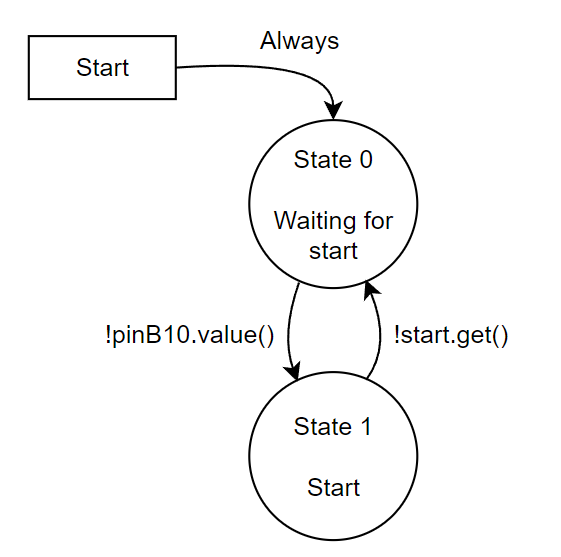

<h2>Scott Frizzell & Jacques Lacroix</h2>

<h3>Software Overview</h3>
The software for this project was divided into 6 main parts:
<ol>
    <li>`main.py` - The primary program responsible for controlling the rest of the software and hardware interaction</li>
    <li>`controller.py` - A PID motor controller implemented for a brushed DC motor with and encoder</li>
    <li>`motor_driver.py` - A motor driver used by the controller to interact with the DC motor</li>
    <li>`encoder_reader.py` - An encoder driver used by the controller to interact with a quadrature encoder</li>
    <li>`servo.py` - A servo driver used to control the other axis of motion and firing the weapon</li>
    <li>`mlx_cam.py` and `/mlx90640` - A wrapper class used to interact with the MLX thermal camera used for tracking</li>
</ol>

<h3>Task Overview</h3>
`main.py` was divided into 5 different tasks, each responsible for controlling a different part of the turret.

<h4>Task 1</h4>
Task 1 is responsible for controlling the turrets panning axis using the Controller class.
<ul>
    <li>State 0: Waiting for start - Waits until the start button has been pressed</li>
    <li>State 1: Idle - Waits for a new angle to be set by Task 4</li>
    <li>State 2: Panning - Runs the controller until it has reached its desired location</li>
</ul>

<h4>Task 2</h4>
Task 2 is responsible for starting the turret when the button is pressed.
<ul>
    <li>State 0: Waiting - Waits until the start button has been pressed</li>
    <li>State 1: Start - Waits for the turret to finish firing</li>
</ul>

<h4>Task 3</h4>
Task 3 is responsible for controlling the tilting axis using a Servo.
<ul>
    <li>State 0: Waiting for start - Waits until the start button has been pressed</li>
    <li>State 1: Normal Operation - Sets the servo to the desired location set by Task 4</li>
</ul>

<h4>Task 4</h4>
Task 4 is responsible for interacting with the thermal camera and targeting.
<ul>
    <li>State 0: Waiting for start - Waits until the start button has been pressed</li>
    <li>State 1: Normal Operation - Takes an image when ready and sets desired angles to align turret with target</li>
</ul>

<h4>Task 5</h4>
Task 5 is responsible for actuating the trigger mechanism.
<ul>
    <li>State 0: Waiting for start - Waits until the start button has been pressed</li>
    <li>State 1: Wait for fire - Waits for Task 4 to give the fire command</li>
    <li>State 2: Delay and reset - Pulls the trigger, waits a second, and resets the turret to run again</li>
</ul>

